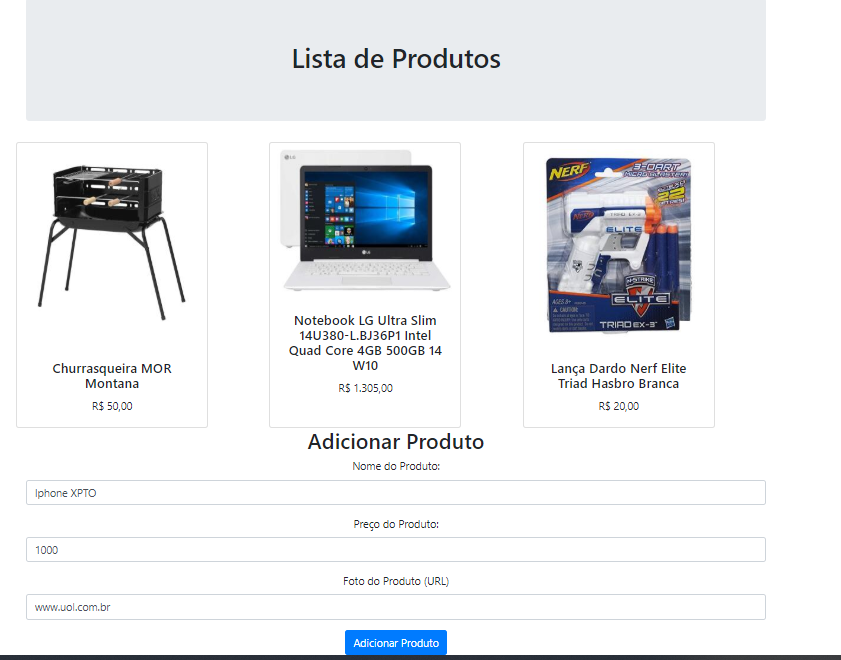

This project was bootstrapped with [Create React App](https://github.com/facebook/create-react-app).

# cowsay WebDev

```bash
< Aula: WEB DEVELOPMENT            >
< Prof. HENRIQUE RUIZ POYATOS NETO >
 -----------------------------
     \   ^__^
      \  (oo)\_______
         (__)\       )\/\
            ||----w |
            ||     ||
by Renato Puga
```

Pegue o último código na página da FIAP e execute as etapas do `npm install` e `npm start`. 
Pronto! Agora você utilizará o projeto do professor.

### Se tudo der certo: `http://localhost:3000`


Se preferir usar um glitch próprio é só seguir as etapas do glitch abaixo e mudar dois arquivos .js:

### `App.js`:

```java
# adicione o seu URL do glitch
fetch("https://puga-produtos.glitch.me/getProdutos")
```

### `addproduto.js`

```java
# adicione o seu URL do glitch
state = {action: 'https://puga-produtos.glitch.me/addProduto',
```


# glitch
Glitch is the friendly community where everyone builds the web: https://glitch.com/

Vamos usar como nosso servidor web sql-lite que produzi uma url válida que vamos utilizar no react.

Então, crie uma conta e clique:

### `New Project > hello-sqlite`

## Estrutura de Diretórios

```
- public/
-- client.js
-- style.css
- public/
-- index.html
package.json
server.js
```


### `client.js`

```java
// client-side js
// run by the browser each time your view template referencing it is loaded

console.log("hello world :o");

const dreams = [];

// define variables that reference elements on our page
const dreamsForm = document.forms[0];
const dreamInput = dreamsForm.elements["dream"];
const dreamsList = document.getElementById("dreams");
const clearButton = document.querySelector('#clear-dreams');

// request the dreams from our app's sqlite database
fetch("/getDreams", {})
  .then(res => res.json())
  .then(response => {
    response.forEach(row => {
      appendNewDream(row.dream);
    });
  });

// a helper function that creates a list item for a given dream
const appendNewDream = dream => {
  const newListItem = document.createElement("li");
  newListItem.innerText = dream;
  dreamsList.appendChild(newListItem);
};

// listen for the form to be submitted and add a new dream when it is
dreamsForm.onsubmit = event => {
  // stop our form submission from refreshing the page
  event.preventDefault();

  const data = { dream: dreamInput.value };

  fetch("/addDream", {
    method: "POST",
    body: JSON.stringify(data),
    headers: { "Content-Type": "application/json" }
  })
    .then(res => res.json())
    .then(response => {
      console.log(JSON.stringify(response));
    });
  // get dream value and add it to the list
  dreams.push(dreamInput.value);
  appendNewDream(dreamInput.value);

  // reset form
  dreamInput.value = "";
  dreamInput.focus();
};

clearButton.addEventListener('click', event => {
  fetch("/clearDreams", {})
    .then(res => res.json())
    .then(response => {
      console.log("cleared dreams");
    });
  dreamsList.innerHTML = "";
});

```

### `package.json`

```json
{
  "//1": "describes your app and its dependencies",
  "//2": "https://docs.npmjs.com/files/package.json",
  "//3": "updating this file will download and update your packages",
  "name": "hello-sqlite",
  "version": "0.0.1",
  "description": "A simple Node app with SQLite as a database management system, instantly up and running.",
  "main": "server.js",
  "scripts": {
    "start": "node server.js"
  },
  "dependencies": {
    "express": "^4.16.4",
    "sqlite3": "^4.1.0",
    "cors": "^2.8.5"
  },
  "engines": {
    "node": "8.x"
  },
  "repository": {
    "url": "https://glitch.com/edit/#!/hello-sqlite"
  },
  "license": "MIT",
  "keywords": [
    "node",
    "glitch",
    "express"
  ]
}
```

### `style.css`

```css
/* styles */
/* called by your view template */

* {
  box-sizing: border-box;
}

body {
  font-family: helvetica, arial, sans-serif;
  margin: 2em;
}

h1 {
  font-style: italic;
  color: #373fff;
}

.bold {
  font-weight: bold;
}

p {
  max-width: 600px;
}

form {
  margin-bottom: 25px;
  padding: 15px;
  background-color: cyan;
  display: inline-block;
  width: 100%;
  max-width: 340px;
  border-radius: 3px;
}

input {
  display: block;
  margin-bottom: 10px;
  padding: 5px;
  width: 100%;
  border: 1px solid lightgrey;
  border-radius: 3px;
  font-size: 16px;
}

button {
  font-size: 16px;
  border-radius: 3px;
  background-color: lightgrey;
  border: 1px solid grey;
  box-shadow: 2px 2px teal;
  cursor: pointer;
}

button:hover {
  background-color: yellow;
}

button:active {
  box-shadow: none;
}

li {
  margin-bottom: 5px;
}

footer {
  margin-top: 50px;
  padding-top: 25px;
  border-top: 1px solid lightgrey;
}
```


### `server.js`

```java
// server.js
// where your node app starts

// init project
const express = require("express");
const bodyParser = require("body-parser");
const app = express();
const fs = require("fs");

// liberar CORS compartilhamento de informacoes de dois dominios
var cors = require("cors");
app.use(cors());

app.use(bodyParser.urlencoded({ extended: true }));
app.use(bodyParser.json());

// we've started you off with Express,
// but feel free to use whatever libs or frameworks you'd like through `package.json`.

// http://expressjs.com/en/starter/static-files.html
app.use(express.static("public"));

// init sqlite db
const dbFile = "./.data/sqlite2.db";
const exists = fs.existsSync(dbFile);
const sqlite3 = require("sqlite3").verbose();
const db = new sqlite3.Database(dbFile);

// if ./.data/sqlite.db does not exist, create it, otherwise print records to console
db.serialize(() => {
  if (!exists) {
    db.run(
      "CREATE TABLE produtos (id INTEGER PRIMARY KEY AUTOINCREMENT, nome TEXT, preco REAL, foto_url TEXT)"
    );
    console.log("New table produtos created!");

    // insert default produtos
    db.serialize(() => {
      db.run(
        'INSERT INTO produtos (nome,preco,foto_url) VALUES ("Churrasqueira MOR Montana ",50,"https://static.pelando.com.br/live/threads/thread_large/default/371507_2.jpg"), ("Notebook LG Ultra Slim 14U380-L.BJ36P1 Intel Quad Core 4GB 500GB 14 W10",1305,"https://static.pelando.com.br/live/threads/thread_large/default/368789_1.jpg"), ("Lança Dardo Nerf Elite Triad Hasbro Branca",20,"https://static.pelando.com.br/live/threads/thread_large/default/371592_1.jpg")'
      );
    });
  } else {
    console.log('Database "produtos" ready to go!');
    db.each("SELECT * from produtos", (err, row) => {
      if (row) {
        console.log(`record: ${row.produtos}`);
      }
    });
  }
});

// http://expressjs.com/en/starter/basic-routing.html
app.get("/", (request, response) => {
  response.sendFile(`${__dirname}/views/index.html`);
});

// endpoint to get all the dreams in the database
app.get("/getProdutos", (request, response) => {
  db.all("SELECT * from produtos", (err, rows) => {
    response.send(JSON.stringify(rows));
  });
});

// endpoint to add a dream to the database
app.post("/addProduto", (request, response) => {
  console.log(`add to dreams ${request.body}`);

  // DISALLOW_WRITE is an ENV variable that gets reset for new projects so you can write to the database
  if (!process.env.DISALLOW_WRITE) {
    const nome     = cleanseString(request.body.nome);
    const preco    = cleanseString(request.body.preco);
    const foto_url = cleanseString(request.body.foto_url);
    db.run(`INSERT INTO produtos (nome, preco, foto_url) VALUES (?, ?, ?)`, nome, preco, foto_url, error => {
      if (error) {
        response.send({ message: "error!" });
      } else {
        response.send({ message: "success" });
      }
    });
  }
});

// endpoint to clear dreams from the database
app.get("/clearProduto", (request, response) => {
  // DISALLOW_WRITE is an ENV variable that gets reset for new projects so you can write to the database
  if (!process.env.DISALLOW_WRITE) {
    db.each(
      "SELECT * from Dreams",
      (err, row) => {
        console.log("row", row);
        db.run(`DELETE FROM Dreams WHERE ID=?`, row.id, error => {
          if (row) {
            console.log(`deleted row ${row.id}`);
          }
        });
      },
      err => {
        if (err) {
          response.send({ message: "error!" });
        } else {
          response.send({ message: "success" });
        }
      }
    );
  }
});

// helper function that prevents html/css/script malice
const cleanseString = function(string) {
  return string.replace(/</g, "&lt;").replace(/>/g, "&gt;");
};

// listen for requests :)
var listener = app.listen(process.env.PORT, () => {
  console.log(`Your app is listening on port ${listener.address().port}`);
});
```

### `index.html`

```html
<!-- This is a static file -->
<!-- served from your routes in server.js -->

<!DOCTYPE html>
<html lang="en">
  <head>
    <title>Welcome to Glitch!</title>
    <meta name="description" content="A cool thing made with Glitch">
    <link id="favicon" rel="icon" href="https://glitch.com/edit/favicon-app.ico" type="image/x-icon">
    <meta charset="utf-8">
    <meta http-equiv="X-UA-Compatible" content="IE=edge">
    <meta name="viewport" content="width=device-width, initial-scale=1">

    <!-- import the webpage's stylesheet -->
    <link rel="stylesheet" href="/style.css">
    
    <!-- import the webpage's client-side javascript file -->
    <script src="/client.js" defer></script>
  </head>
  <body>
    <header>
      <h1>
        A Dream of the Future
      </h1>
    </header>

    <main>
      <p class="bold">Oh hi,</p>
      
      <p>Tell me your hopes and dreams:</p>
      
      <form>
        <input name="dream" aria-label="a new dream" type="text" maxlength="100" placeholder="Dreams!">
        <button type="submit" id="submit-dream">Submit Dream</button>
      </form>
      
      <section class="dreams">
        <ul id="dreams"></ul>
        <button id="clear-dreams">
          Clear Dreams
        </button>
      </section>
      
    </main>

    <footer>
      Made with <a href="https://glitch.com">Glitch</a>!
    </footer>

    <!-- include the Glitch button to show what the webpage is about and
          to make it easier for folks to view source and remix -->
    <div class="glitchButton" style="position:fixed;top:20px;right:20px;"></div>
    <script src="https://button.glitch.me/button.js"></script>

  </body>
</html>

```

https://glitch.com/


## Após Baixar e Descompactar o Projeto

Entre no diretório do projeto e rode:

```bash
C:\react-produtos> pwd

Path
----
C:\react-produtos

C:\react-produtos npm install

# .... uma porrada de coisa

C:\react-produtos npm start
```

Agora, Executa o aplicativo no modo de desenvolvimento.
Abra [http: // localhost: 3000] (http: // localhost: 3000) para visualizá-lo no navegador.


